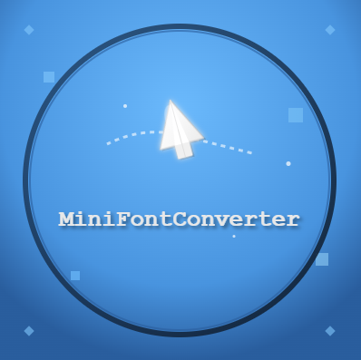

Allow text conversion from default font to MiniFont style in-game (Minecraft: Java Edition)

With this plugin, you will be able to convert texts/messages to the MiniFont style.
In this case, you can use it to easily decorate GUI inventories' titles and lores,
holograms and many more text contents with a fast click & copy in-game chat.

Compatible with: Paper and forks, version 1.20 and above.

Commands:

* /minifontconverter <input> - Convert the message content to MiniFont style
* /minifontchatoggle <option> - Enable or disable the chat auto conversion feature
* /minifontreload - Reload plugin configurations and data

Permissions:

* minifontconverter.* - Permission to use all plugin commands
* minifontconverter.convert.use - Permission to use /minifontconverter
* minifontconverter.convert.chat.use - Permission to toggle the chat auto conversion feature
* minifontconverter.reload - Permission to use the administrative reload command
